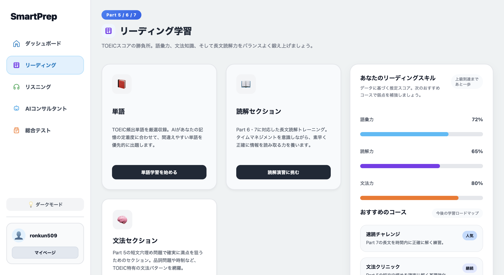
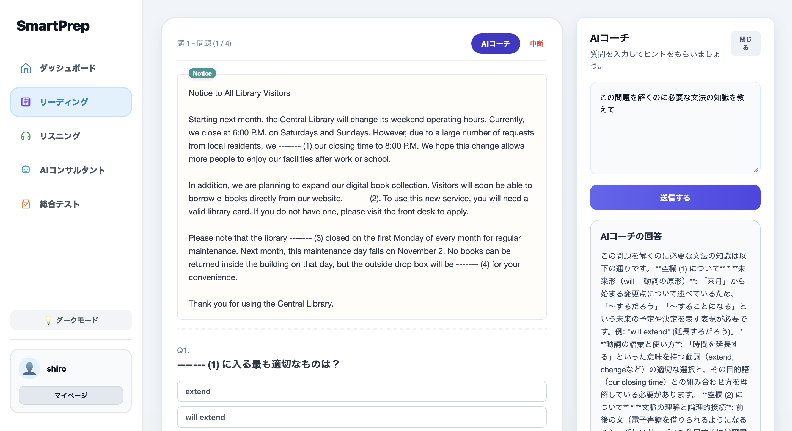
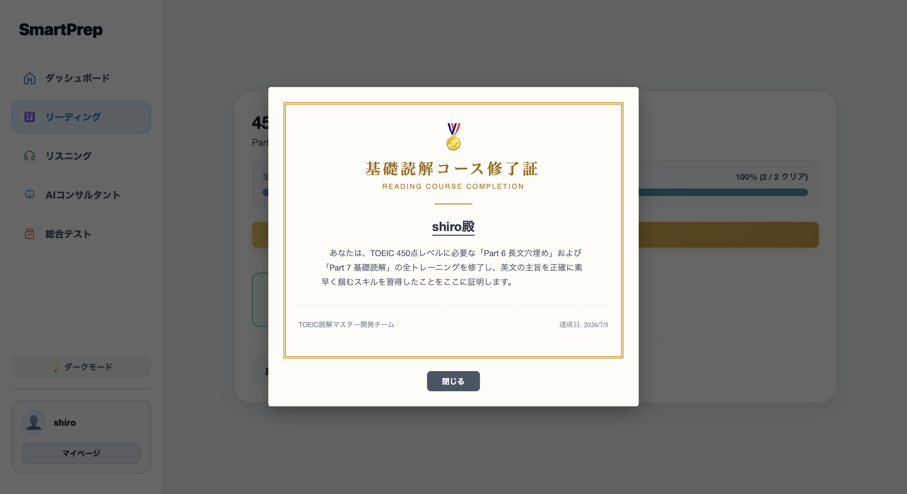
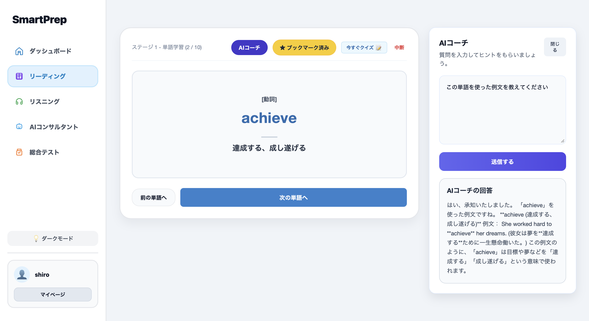
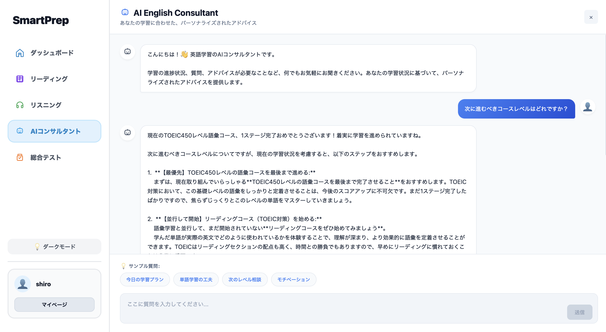

# SmartPrep

SmartPrep is a TOEIC-focused English learning app for Japanese learners. It combines structured vocabulary and reading courses with an AI English consultant so users can study with personalized guidance instead of relying only on static materials.







## Overview

SmartPrep is designed to help learners prepare for TOEIC in a simple and focused way:

- Keep the experience lightweight and easy to start.
- Provide structured vocabulary and reading study paths.
- Offer AI-powered advice based on the learner's bookmarked words and course progress.
- Support a smooth learning flow from landing page to course study and review.

## Main Features

- User authentication flow with signup, login, password reset, and email verification
- JWT-based session handling with frontend token persistence
- Vocabulary study courses for TOEIC levels 450, 600, 730, and 860
- Reading study courses with level-based progression
- Bookmark vocabulary management with custom word addition and search
- AI Consultant that answers questions using the learner's saved vocabulary and course progress context
- My page and study progress tracking via browser storage
- Responsive UI with sidebar-based navigation

## Tech Stack

### Frontend
- React 19.2.7
- Vite 8.1.0
- JSX-based UI components
- Local storage for authentication, bookmarks, and course progress
- REST API communication with FastAPI

### Backend
- FastAPI
- Uvicorn
- SQLAlchemy
- SQLite
- PyJWT
- Pydantic
- Email verification support via email-validator

### AI Integration
- Gemini API via google-genai
- Context-aware question answering for personalized learning support

## Project Structure

- backend/ — FastAPI backend, authentication routes, AI endpoint, and database setup
- front/ — React + Vite frontend and feature-based UI components
- front/src/features/vocabulary/ — vocabulary courses, progress storage, and bookmark functionality
- front/src/features/LandingPage/components/ — dashboard, AI consultant, and learning pages

## Authentication Flow

1. A user signs up with name, email, and password.
2. The backend stores pending signup data and generates a verification code.
3. The code is sent by email when SMTP is configured, otherwise it is displayed in the terminal during local development.
4. The user verifies the account and completes registration.
5. A JWT token is issued and stored in the frontend.

## Getting Started

### 1) Backend

```bash
cd backend
python3 -m venv .venv
source .venv/bin/activate
pip install -r requirements.txt
python3 -m uvicorn main:app --reload --host 0.0.0.0 --port 8000
```

### 2) Frontend

```bash
cd front
npm install
npm run dev
```

Then open the frontend in your browser.

### 3) Docker Compose

```bash
docker compose up --build
```

## Environment Variables

Create a backend environment file with the following values:

- SECRET_KEY — JWT signing key
- JWT_ALGORITHM — typically HS256
- ACCESS_TOKEN_EXPIRE_MINUTES — access token expiration time
- GOOGLE_API_KEY or GEMINI_API_KEY — required for AI answers
- SMTP_HOST, SMTP_PORT, SMTP_USER, SMTP_PASSWORD, FROM_EMAIL — optional email configuration

If SMTP is not configured, verification codes are shown in the terminal for local development.

## Current Status

SmartPrep currently includes:

- Authentication and account verification
- Vocabulary and reading course flows
- Bookmark-based vocabulary study and custom word entry
- AI consultant support using user-specific learning context
- Local progress persistence for study history and bookmarks

## Notes

- Vocabulary and course progress are stored in browser local storage for the current user session.
- The AI Consultant uses the learner's bookmarked words and course progress to generate more relevant advice.
- The app is intentionally focused on a simple TOEIC study experience rather than a broad general-purpose English platform.
