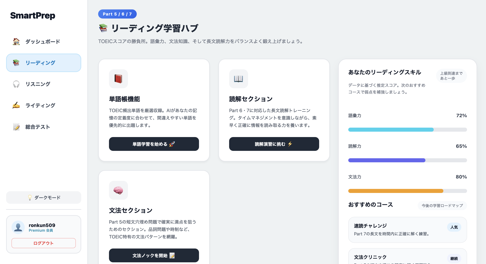

# SmartPrep

SmartPrep is designed for Japanese TOEIC learners who want to achieve high scores by using AI efficiently. It removes unnecessary features to lower the learning barrier and provides instant, appropriate answers that analog study methods cannot deliver.



## Purpose

- Support Japanese native speakers aiming for high TOEIC scores.
- Keep the app body as simple as possible so users can start learning without friction.
- Deliver instant AI-backed feedback and explanations that are difficult to obtain from analog learning alone.

## Key Differentiators

- Minimal feature set to reduce cognitive load and app complexity.
- Focused TOEIC preparation flow rather than a general-purpose English learning tool.
- AI-powered response system that provides fast, context-aware guidance.
- Simple UX that encourages continuous study by removing distractions.

## Features

- Login and signup flow with email verification.
- JWT-based authentication for secure session handling.
- AI-friendly architecture for future expansion with TOEIC-style question generation, explanations, and instant corrections.
- Lightweight frontend experience built with React and Vite.
- FastAPI backend with SQLite for quick local deployment.

## Tech Stack

### Frontend
- React 19
- Vite
- JSX components
- `localStorage` for storing authentication tokens and user state
- REST API communication with FastAPI

### Backend
- FastAPI
- Uvicorn
- SQLAlchemy
- SQLite
- PyJWT
- Pydantic
- Email verification code support

### Development
- Docker / docker-compose support available in the repository
- Local development mode with separate frontend and backend services

## Architecture Overview

### Authentication Flow
1. User signs up with name, email, and password.
2. Backend stores pending signup data and generates a verification code.
3. Verification code is sent via email, or printed to the terminal during local development.
4. User enters the code to complete account creation.
5. Backend issues a JWT access token after successful verification.
6. Login also returns a JWT token and persists it in the frontend.

### Key Files
- `backend/main.py` — FastAPI app setup, CORS configuration, router registration
- `backend/routers/auth.py` — signup, verify-signup, and login endpoints
- `backend/security.py` — password hashing, verification code generation, JWT creation
- `backend/models.py` — `User` and `PendingSignup` models
- `backend/database.py` — SQLite database connection and session handling
- `front/src/features/auth/hooks/useAuth.js` — authentication API calls and token persistence
- `front/src/features/auth/components/` — login, signup, and verification form components

## Getting Started

### Run backend locally
```bash
cd EnglishLearningApp/backend
python3 -m uvicorn main:app --reload --host 0.0.0.0 --port 8000
```

### Run frontend locally
```bash
cd EnglishLearningApp/front
npm install
npm run dev
```

### Run with Docker
```bash
cd EnglishLearningApp
docker compose up --build
```

## Environment Settings

### Backend environment variables
- `SECRET_KEY` — JWT signing key
- `JWT_ALGORITHM` — usually `HS256`
- `ACCESS_TOKEN_EXPIRE_MINUTES` — token expiration time
- `SMTP_HOST`, `SMTP_PORT`, `SMTP_USER`, `SMTP_PASSWORD`, `FROM_EMAIL` — optional email settings

> If SMTP is not configured, the verification code is output to the terminal for local development.

## Current Status and Estimated Work

### Current status
- Authentication flow is implemented.
- Login, signup, and email verification form flows exist.
- JWT authorization and frontend token storage are connected.
- TOEIC-specific AI content is still a future expansion area.

### Estimated remaining effort
- AI problem generation and TOEIC content integration: 
- UI/UX improvements and responsive polishing: 
- Production hardening, secrets, SMTP, and security improvements:


## Why this app is different

- It is built specifically for TOEIC learners, not general English learners.
- It uses AI to provide fast, accurate feedback in a study flow designed for Japanese users.
- It intentionally limits features so users can focus on learning instead of being overwhelmed.
