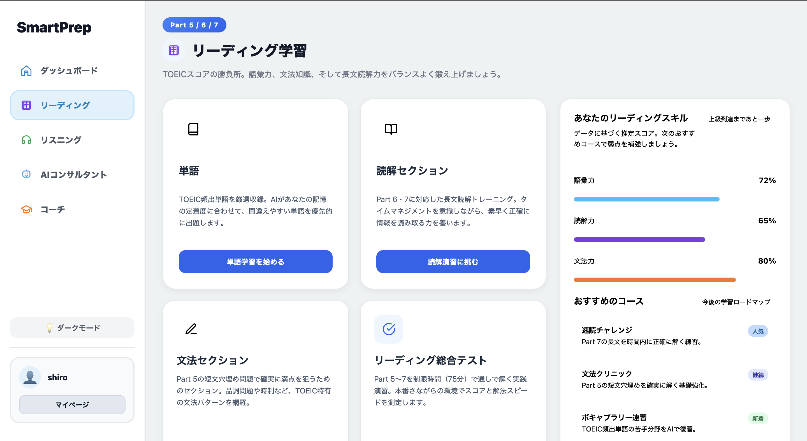
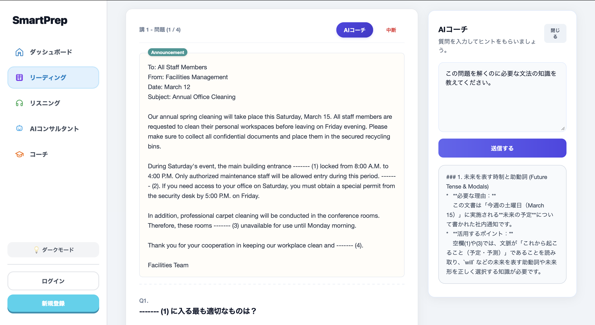
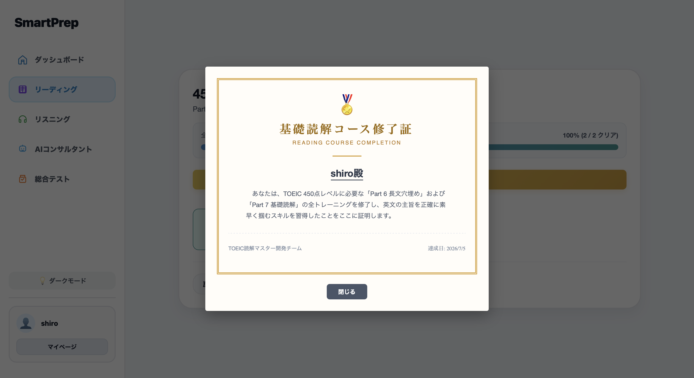
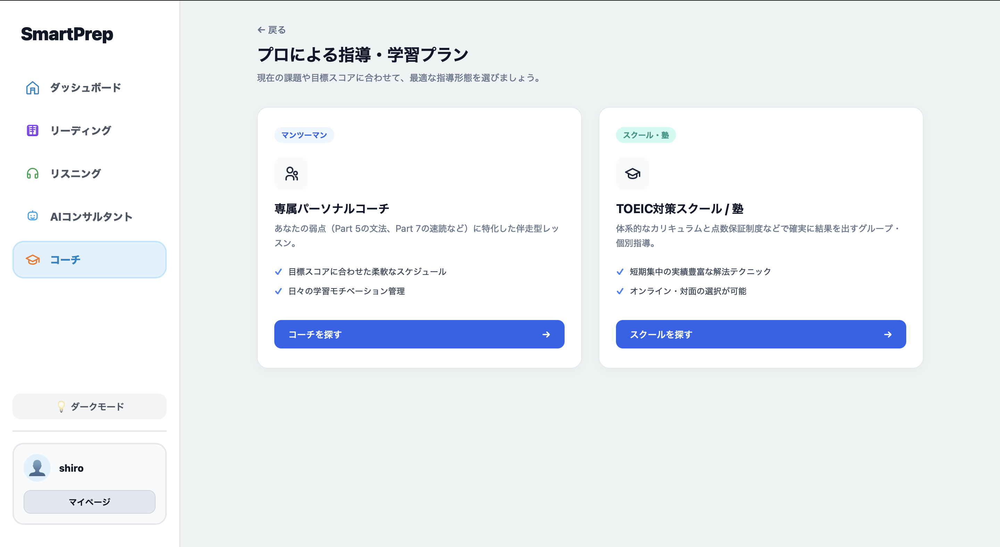
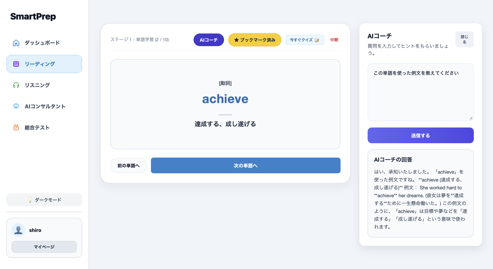
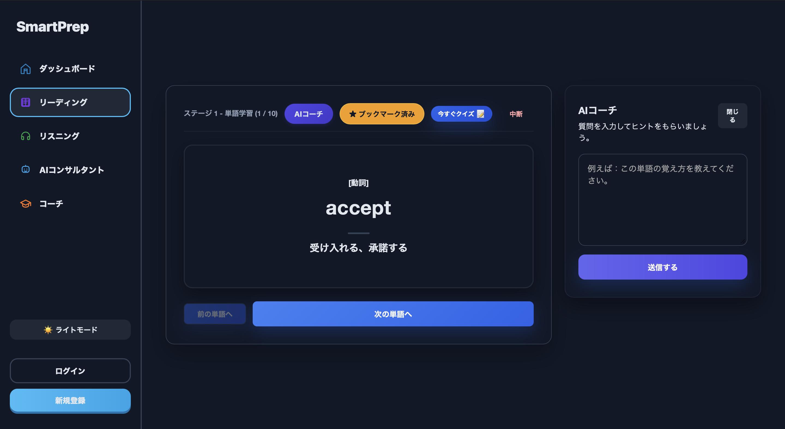
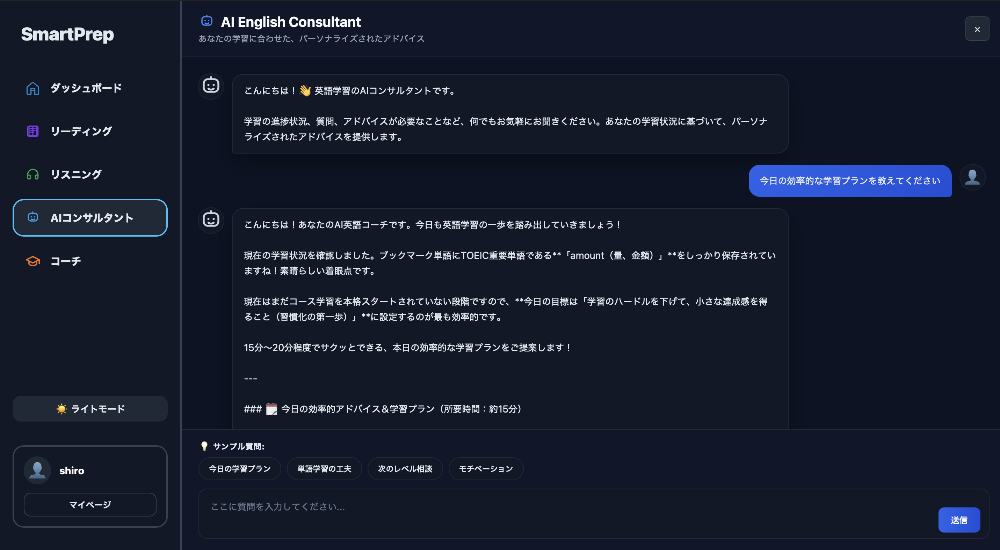
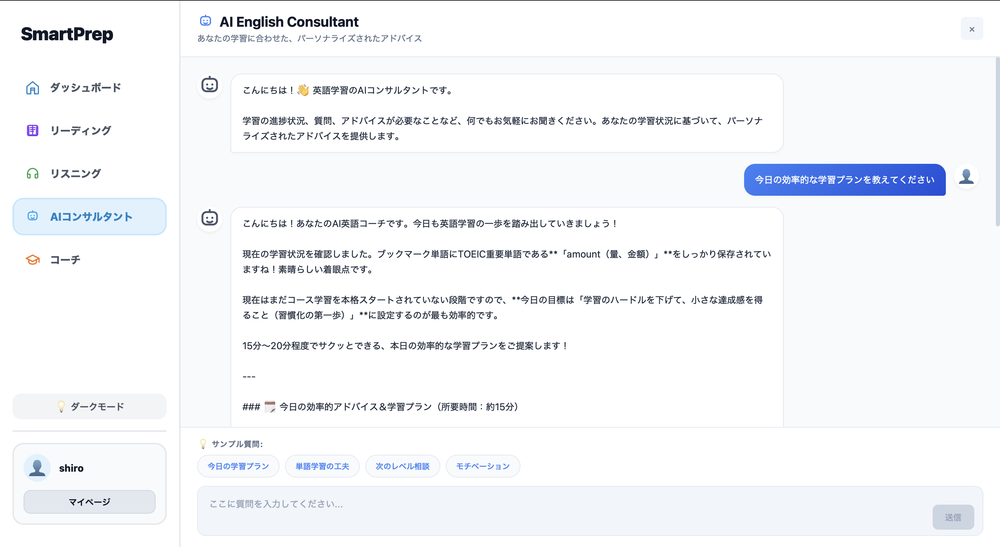

# SmartPrep

SmartPrep is a TOEIC-focused English learning app tailored for Japanese learners. By combining structured vocabulary and reading courses with an AI English consultant, it provides personalized guidance instead of relying solely on static study materials.










## Overview

SmartPrep is designed to help learners prepare for TOEIC in a simple, highly focused manner:

* Delivers a lightweight, easily accessible learning experience (supporting both guest and logged-in users).
* Offers structured learning paths for vocabulary and reading comprehension.
* Provides context-aware AI advice based on bookmarked words and course progress.
* Supports a seamless flow from the landing page to course study and review.

## Main Features

* User authentication flow including signup, login, password reset, and email verification
* JWT-based session management with persistent frontend storage
* Vocabulary study courses targeting TOEIC score levels 450, 600, 730, and 860
* Reading comprehension courses with level-based progression
* Bookmark management for vocabulary with custom word creation and search
* AI Consultant that answers questions using the learner's saved vocabulary and course progress context
* Flexible progress persistence (saved to backend database for logged-in users; local storage for guest users)
* Responsive UI featuring sidebar navigation

## Tech Stack

### Frontend

* React 19.2.7
* Vite 8.1.0
* JSX-based UI components
* Browser storage for guest user data persistence
* REST API integration via FastAPI for data synchronization

### Backend

* FastAPI
* Uvicorn
* SQLAlchemy
* PostgreSQL (Production) / SQLite (Local development)
* PyJWT
* Pydantic
* Email verification support via email-validator

### AI Integration

* Gemini API via `google-genai`
* Context-aware question answering for personalized learning support

## Project Structure

* `backend/` — FastAPI backend, authentication routes, AI endpoint, progress management API, and database configuration
* `front/` — React + Vite frontend and feature-based UI components
* `front/src/features/vocabulary/` — Vocabulary courses, progress storage, and bookmark functionality
* `front/src/features/LandingPage/components/` — Dashboard, AI consultant, and learning pages

## Authentication Flow

1. A user signs up using name, email, and password.
2. The backend stores pending signup data and generates a verification code.
3. The code is sent via email when SMTP is configured; otherwise, it displays in the terminal during local development.
4. The user verifies the account to complete registration.
5. A JWT token is issued and stored on the frontend.

## Getting Started

### 1) Backend

```bash
cd backend
python3 -m venv .venv
source .venv/bin/activate
pip install -r requirements.txt
python3 -m uvicorn main:app --reload --host 0.0.0.0 --port 8000

```

### 2) Frontend

```bash
cd front
npm install
npm run dev

```

Then open the frontend URL in your browser.

### 3) Docker Compose

```bash
docker compose up --build

```

## Environment Variables

Create a backend environment file with the following parameters:

* `SECRET_KEY` — JWT signing key
* `JWT_ALGORITHM` — Typically `HS256`
* `ACCESS_TOKEN_EXPIRE_MINUTES` — Access token expiration period (in minutes)
* `GOOGLE_API_KEY` or `GEMINI_API_KEY` — Required for AI response generation
* `DATABASE_URL` — Database connection string (e.g., PostgreSQL string for production)
* `SMTP_HOST`, `SMTP_PORT`, `SMTP_USER`, `SMTP_PASSWORD`, `FROM_EMAIL` — Optional SMTP email configuration

If SMTP is not configured, verification codes will print to the terminal for local testing.

## Current Status

SmartPrep currently includes:

* Authentication and account verification
* Vocabulary and reading comprehension course flows
* Bookmark-based vocabulary study and custom word entry
* AI Consultant utilizing individual learning context
* Backend progress tracking for logged-in users and local storage backup for guest users

## Upcoming Features (Roadmap)

* **Dashboard & My Page Learning Analytics**: Integrated dashboards to visualize progress, learning stats, and detailed history.
* **Smart Course Recommendations**: Automated suggestions on the dashboard for ongoing courses and optimal next steps.
* **AI-Powered Skill Assessment**: Real-time generation of custom test questions to evaluate user proficiency accurately.
* **Speech & Shadowing Features**: Voice API integration to support dedicated English shadowing practice.
* **Coaching & Tutor Integration**: Platform connectivity to pair learners with professional freelance tutors and tutoring centers for human coaching.

## Notes

* Study progress and bookmarks for logged-in users are persisted to the backend database (PostgreSQL in production) for multi-device sync. Guest progress is stored temporarily in browser local storage.
* The AI Consultant leverages saved vocabulary and course progress data to generate relevant, tailored advice.
* The platform is intentionally tailored to provide a streamlined, TOEIC-focused study environment rather than a broad, generic language suite.